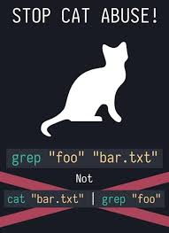

# Simple Bash Utils. 

### Own implementation and Development of Bash text utilities: cat, grep.

|  |
| :---------------------: |

  - The program was developed and implemented on MacOs Big Sur Version 11.6.6 and repeats the behavior of the cat and grep utilities on zsh 5.8 (x86_64-apple-darwin20.0) with minor modifications and my own vision of the correct implementation.
  - You may run the tests for each utility if you change directory to `/src/cat/testing` or `/src/grep/testing` and run the script with `sh` command for better overview.
  ```zsh
  sh mytest_s21_cat.sh
  sh mytest_s21_grep.sh
  ```
  - Testing with my integration tests on Linux will not display the correct result due to the difference in the implementation of standard utilities and the logic in the bash script
  - For style tests and static code analysis, the `clang-format` and `cppcheck` utilities must be installed, respectively.
